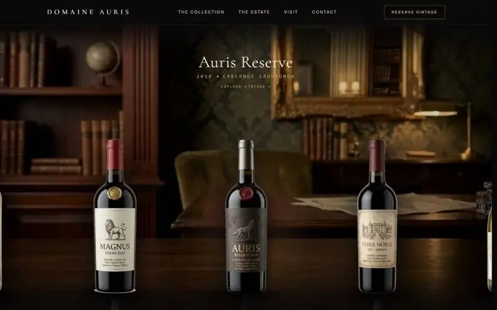
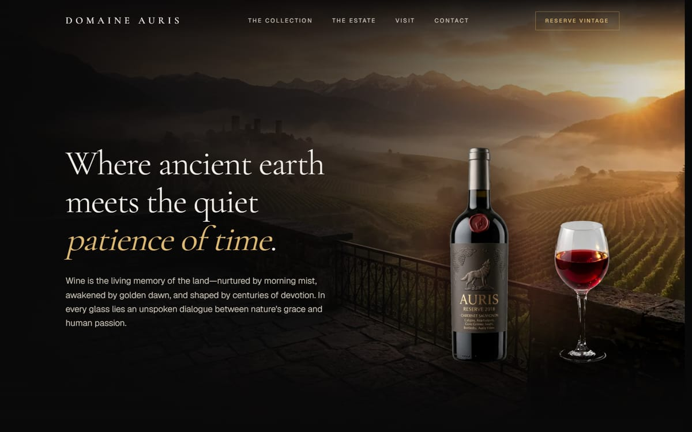
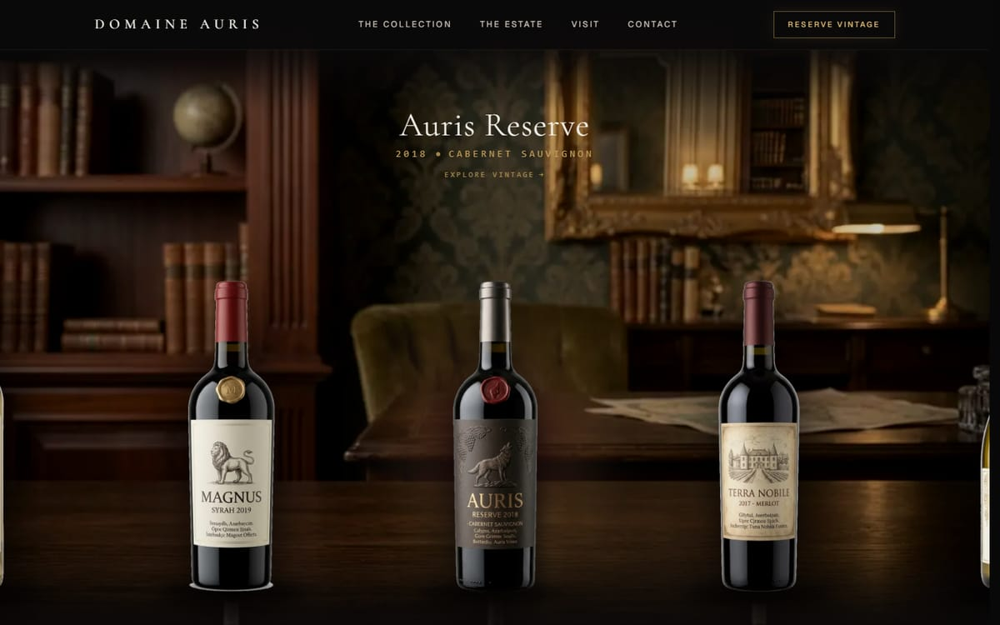
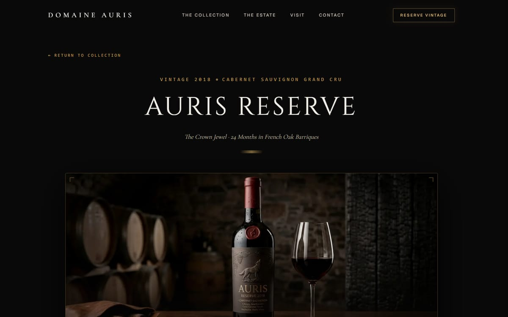
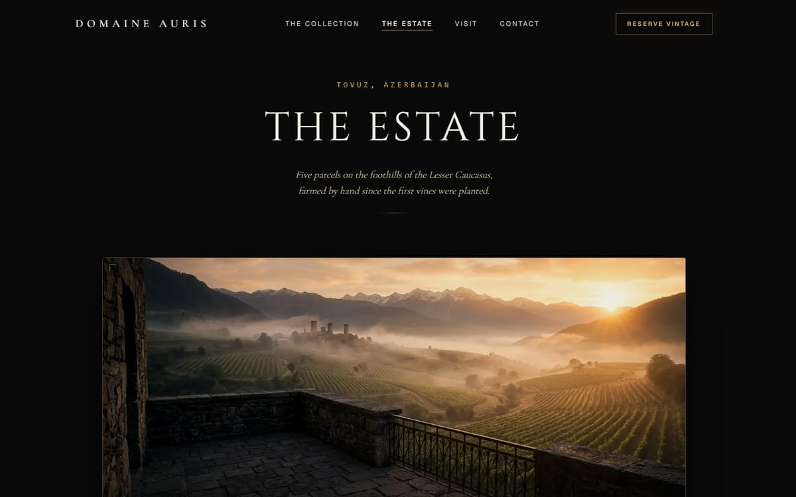
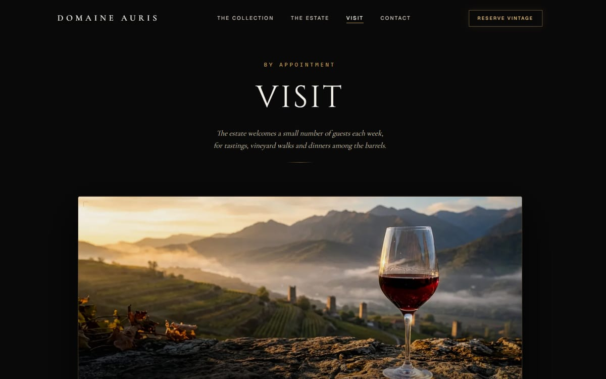
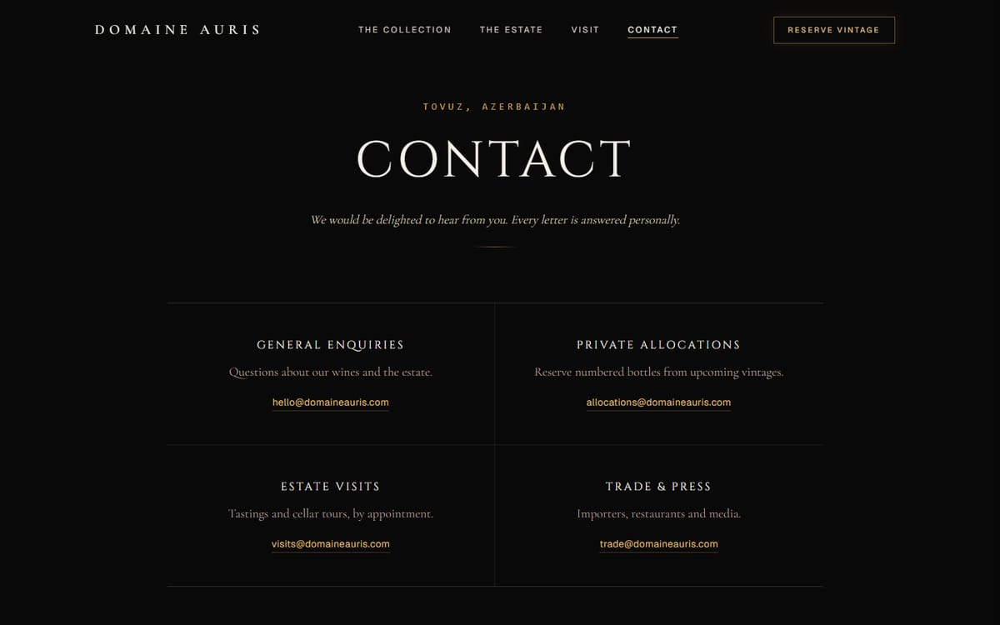

# Domaine Auris

A cinematic website concept for a small wine estate in Tovuz, Azerbaijan, built with Next.js 16 and React 19.

> **Design concept.** Domaine Auris is a fictional estate. The wines, people, addresses and contact details are invented for this portfolio piece.



## Highlights

- **Pour transition.** Clicking a bottle in the collection opens a curtain from that bottle. The bottle glides to centre stage and pours into an SVG glass, in the colour of that wine. The wine's page loads behind the curtain, and the curtain lifts only once the page's images have decoded. The wine list on the Estate page pours the same way, with the bottle growing out of the clicked name. The navbar links to The Estate, Visit and Contact, and the way back to the collection from a wine page, close the same curtain with the page name on it. Built on the Web Animations API with no animation library, and reduced to a short fade for visitors who prefer reduced motion.
- **Scroll-driven home page.** The hero bottle travels through the story chapters and lands on the table, where the collection becomes a draggable carousel. Scrolling is smoothed with Lenis.
- **Refresh keeps your place.** Reloading a page returns you to the same scroll position, with Lenis kept in sync with the browser's own scroll restoration.
- **Age gate on every visit.** The gate is server-rendered, so no content shows before it. It locks scrolling and makes the page behind it inert. Answering "No" sends the visitor to Google and replaces the history entry.
- **Editorial pages.** The Estate, Visit and Contact pages share one set of layout components. The Estate's vineyard list is generated from the wine data.
- **Fully static.** Every route, including the five wine pages, is prerendered at build time.

## Pages

| Home | Collection |
| --- | --- |
|  |  |
| **Wine page** | **The Estate** |
|  |  |
| **Visit** | **Contact** |
|  |  |

## Tech stack

- [Next.js 16](https://nextjs.org) (App Router, static generation, `next/image`, `next/font`)
- React 19 and TypeScript
- Tailwind CSS 4
- [Lenis](https://github.com/darkroomengineering/lenis) for smooth scrolling
- Web Animations API and inline SVG for the pour transition

## Getting started

Requires Node.js 20.9 or later.

```bash
npm install
npm run dev
```

Open [http://localhost:3000](http://localhost:3000).

| Script | What it does |
| --- | --- |
| `npm run dev` | Start the development server |
| `npm run build` | Create a production build |
| `npm run start` | Serve the production build |
| `npm run lint` | Run ESLint |

## Project structure

```
app/
  page.tsx               Home: hero, story chapters and the collection
  wines/[slug]/page.tsx  One page per wine
  estate/ visit/ contact/
components/
  WineExperience.tsx     Scroll-driven home experience and bottle carousel
  PourTransition.tsx     Curtain, bottle, glass and pour sequence
  AgeGate.tsx            Age verification shown on every visit
  SmoothScrollProvider   Lenis setup and scroll restoration
  PageElements.tsx       Shared layout for the editorial pages
data/
  wines.ts               The five wines, including the colour poured into the glass
  estate.ts              Address, hours and enquiry emails
docs/                    Images used in this README
```
